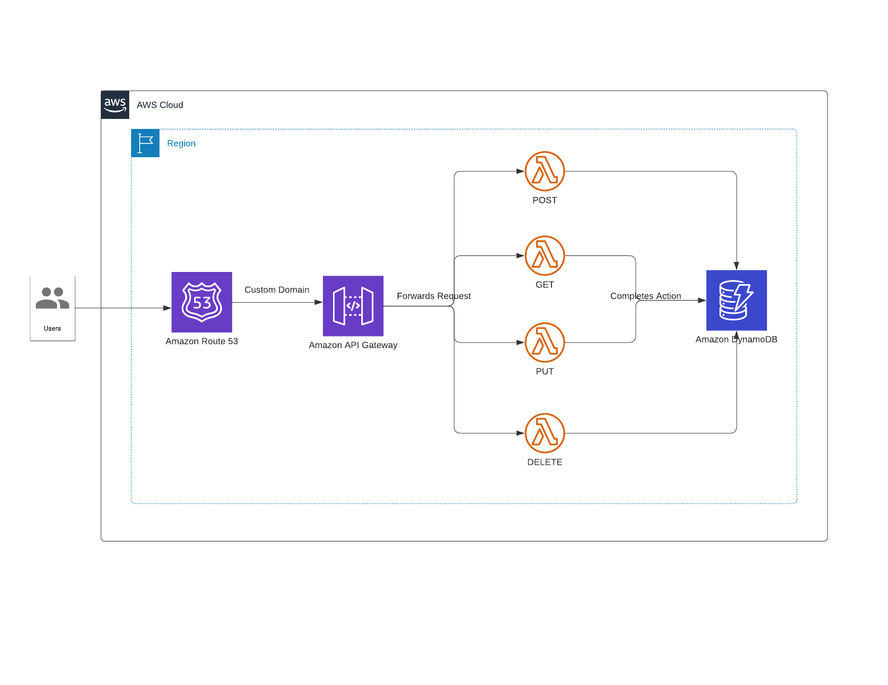

# AWS API CRUD Template

This is a API CRUD template that can expedite development. The infrastructure is deployed through terraform. There are API Gateway, Lambda, and DynamoDB resources along with Route 53 to levarage a custom domain for the endpoints. The lambda function source code is detailed but only contains the basics for CRUD operations and 2xx status codes.

## Architecture Diagram



## Table of Contents

- [Installation](#installation)
- [Usage](#usage)
- [Features](#features)
- [Documentation](#documentation)
- [Contributing](#contributing)
- [License](#license)
- [Acknowledgements](#acknowledgements)
- [Contact](#contact)

## Installation

After cloning this repository, ensure you have the right versions of `npm` and `node`:

```
node == 15.5.1
npm == 8.19.0
```

You can use an [NVM package](https://github.com/nvm-sh/nvm/blob/master/README.md) to change your npm and node versions.

This enables creating the `dist` packages that are used to upload the right source code to the lambda functions.

Ensure you have Terraform installed:
```
brew install terraform
```

I am using Terraform version 1.4.6 but others may be viable. You can run this line to determine the version you have installed:
```
terraform -v
```

Please install the packages detailed in package.json. These packages are used by the application. You can download the packages by running this command:
```
npm install
```

Also you will need an [AWS account](https://docs.aws.amazon.com/accounts/latest/reference/manage-acct-creating.html) to deploy this infrastructure. Here are some more detailed instructions for [creating an account and setting up an admin user](https://docs.aws.amazon.com/streams/latest/dev/setting-up.html).

Once you create an account, you can either export your credentials or simply configure your profile in terminal to use your AWS account. I recommend configure your profile in terminal using the [AWS CLI](https://docs.aws.amazon.com/cli/latest/userguide/cli-chap-configure.html). Once you have setup your credentials in your `.aws` directory usually in a file called `credentials` which specifies the `aws_access_key_id` and `aws_secret_access_key`, you can run the following command to configure your profile:

```
aws configure --profile <name_of_profile>
```

The IAM for an admin role is defined in the `terraform.tf` file which is used to deploy resources to AWS.

I lazily use a profile with admin permissions, but you can create a more security appropriate profile.

Please note using these resources WILL cost money. Please check [AWS billing](https://aws.amazon.com/aws-cost-management/aws-billing/) to note the cost. For most users will little to no traffic, the costs is relatively low. But please be aware of the finanical cost associated. I recommend [setting up an budget](https://docs.aws.amazon.com/AmazonCloudWatch/latest/monitoring/monitor_estimated_charges_with_cloudwatch.html) and getting alarmed in case your total cost reaches a certain threshold.

Also note that a domain name needs to be purchased to leverage the custom domain setup for the endpoints. However, this is optional. You can simply comment out the custom domain resources detailed in `main.tf` that relate to Route 53.

## Usage

In the root directory for the project you can run the following command to generate the zip packages for the lambda functions which are defined as separate workspaces:

```
npm run package --ws
```

You should notice new zip files in the `dist` folder for the four lambda functions. The `lambda-shared-utils` folder holds shared libraries that can be used by the four CRUD lambdas.

If you are interested in leveraging the custom domain for the api gateway endpoints, you need to register a domain name. Here are some instructions on [how to register a domain name through AWS](https://aws.amazon.com/getting-started/hands-on/get-a-domain/).

Note the domain name variable detailed in `variables.tf`. This name is rendered throughout the resources that will be deployed along with the terraform workspace name. Please update this variable with the name of the domain name registered.

If you aren't interested in leveraging a custom domain, then you can comment out the resources in `main.tf` that relate to route53 and custom domain in api gateway.

Now change directories to the terraform folder with the following command and create a new workspace and intialize terraform:

```
cd terrform
terraform workspace new dev
terraform init
```

This should download any modules that are being used and setup state file by using an S3 bucket (the location of the state file is detailed in the prefix). Please note that we are leveraging S3 to remotely hold the terraform state file. This allows others to collaborate without needing the local terraform state file.

Also note that we are leverging terraform workspaces. You can create separate workspace if you want to separate your dev, stage, preprod, and prod environments. The code is written to account for various environments using the same AWS account (ideally will have separate AWS accounts for the different environments, but I am not feeling so fancy).

Now you can run this command to identify the deployment plan for the terraform resources detailed:

```
terraform plan
```

At this point you should see what resources would be deployed.

If you want to proceed deploying these resources you can enter the following:

```
terraform apply
```

Please note that this will incur some initial costs. 

Also since there are dependencies you may need to continously deploying resources using `terraform apply` until there are no configuration changes.


## Features

To add new lambda functions please review this PR for the PUT endpoint [pull requests](https://github.com/arshyasharifian/crud_template/pull/10/files). These detail the code changes are required. It should be fairly straightforward which changes to `package.json`, `tsconfig.json`, the lambda source code directory, a new terraform lambda file, gateway resources, and IAM permissions. 

There is basic linting configured but more details can and should be added to the `.eslintrc` file.

## Documentation

This medium [article](https://aws.plainenglish.io/how-to-define-a-custom-domain-name-to-api-gateway-rest-apis-35be0399d6da) helped with setting up a custom domain for the API endpoints:

## Contributing

There is still much work that needs to be done to complete this template which include the following:
- CICD pipeline
- Functional and Unit Tests
- Multi-Region Setup
- TF Modules: WAF, API Gateway Resources

If anyone is interested in contributing, please feel free to pull main and create a PR to merge directly to main. It would be nice if you included in the description the changes made and screenshots showcasing those changes. For example, if unit tests are added show the results running those unit tests. 

## License

This repo is licensed under the [BSD 3 Clause License](https://gist.github.com/nicolasdao/a7adda51f2f185e8d2700e1573d8a633#3-clause):

Copyright (c) 2023, Arshya Sharifian
All rights reserved.

Redistribution and use in source and binary forms, with or without
modification, are permitted provided that the following conditions are met:

* Redistributions of source code must retain the above copyright notice, this
  list of conditions and the following disclaimer.

* Redistributions in binary form must reproduce the above copyright notice,
  this list of conditions and the following disclaimer in the documentation
  and/or other materials provided with the distribution.

* Neither the name of the copyright holder nor the names of its
  contributors may be used to endorse or promote products derived from
  this software without specific prior written permission.

THIS SOFTWARE IS PROVIDED BY THE COPYRIGHT HOLDERS AND CONTRIBUTORS "AS IS"
AND ANY EXPRESS OR IMPLIED WARRANTIES, INCLUDING, BUT NOT LIMITED TO, THE
IMPLIED WARRANTIES OF MERCHANTABILITY AND FITNESS FOR A PARTICULAR PURPOSE ARE
DISCLAIMED. IN NO EVENT SHALL THE COPYRIGHT HOLDER OR CONTRIBUTORS BE LIABLE
FOR ANY DIRECT, INDIRECT, INCIDENTAL, SPECIAL, EXEMPLARY, OR CONSEQUENTIAL
DAMAGES (INCLUDING, BUT NOT LIMITED TO, PROCUREMENT OF SUBSTITUTE GOODS OR
SERVICES; LOSS OF USE, DATA, OR PROFITS; OR BUSINESS INTERRUPTION) HOWEVER
CAUSED AND ON ANY THEORY OF LIABILITY, WHETHER IN CONTRACT, STRICT LIABILITY,
OR TORT (INCLUDING NEGLIGENCE OR OTHERWISE) ARISING IN ANY WAY OUT OF THE USE
OF THIS SOFTWARE, EVEN IF ADVISED OF THE POSSIBILITY OF SUCH DAMAGE.

## Acknowledgments

I stand on the shoulder of giants and credit all the developers I have worked with in the past that have resulted in this body of work and knowledge.

## Contact

Do not hesitate to reach out via email if you have any questions or need help using this template: arshyasharifian@gmail.com

Also follow me on Medium if you are interested to learn about other projects I have worked on:

https://medium.com/@arshyasharifian